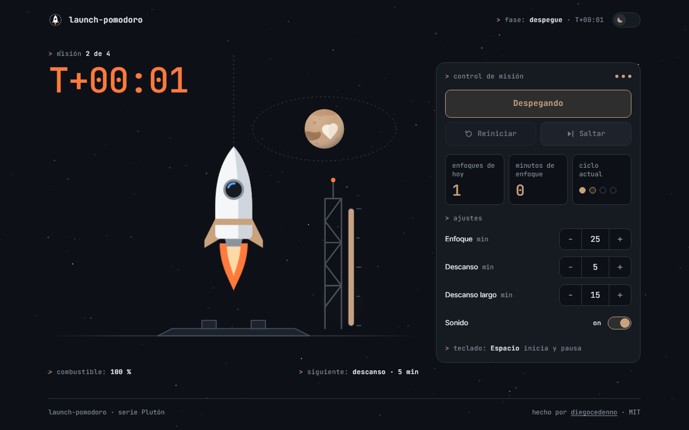

# launch-pomodoro

> A Pomodoro timer staged as a rocket launch: focus on the pad, a T-10 countdown, liftoff, and a break in orbit around Pluto.
>
> Un pomodoro como lanzamiento de cohete: enfoque en la plataforma, cuenta regresiva T-10, despegue y descanso en órbita alrededor de Plutón.

**[Live demo · Demo en vivo →](https://diegocedenno.github.io/launch-pomodoro/)**

**[English](#english)** · **[Español](#español)**

---

## English

### What it does

- Press **Start** (or the space bar) and the focus phase begins: the rocket vents on the pad and the fuel gauge on the tower fills with your progress.
- The last ten seconds are the **T-10 sequence**: the clock turns orange, the service tower retracts, the engines ignite — and at zero the rocket lifts off, accelerating out of frame.
- The break is spent in orbit: the rocket makes exactly one lap around Pluto, then returns to the pad for the next mission. Every fourth mission earns a long break.
- **Skip** never cuts a phase short: it jumps straight to that phase's T-10, so the ending always plays.
- Focus, break and long-break lengths are configurable. Optional sound (off by default) and today's stats — focus sessions, focus minutes and the four-mission cycle — are saved per date in `localStorage`.
- A switch in the header flips between dark and light mode: the same launch site redrawn as a star chart on paper, the white rocket held by an ink outline. The choice is remembered and shared across the Plutón series.

### What makes it technically interesting

- **The clock is computed, not counted.** Remaining time is always `endAt − Date.now()`, so a sleeping laptop or a throttled tab cannot make it drift. The tick itself comes from a tiny Web Worker (built from a `Blob`, so it works on `file://`), which keeps the tab title and the T-10 beeps on time while the tab is in the background; it falls back to `setInterval`.
- **A state machine with no DOM.** `js/timer.js` takes its clock as a parameter and emits events (`start`, `countdown`, `second`, `liftoff`, `break`, `landing`, `ready`). The whole pomodoro cycle is testable in Node with a fake clock.
- **The scene is derived from state.** Tower, fuel, vapour and flame are a pure function of the timer snapshot; only liftoff and landing are one-shot Web Animations. Everything animates `transform` and `opacity` only, and the ascent uses an ease-in curve so the rocket actually accelerates.
- **Sound without files.** Web Audio synthesises the countdown beeps and a liftoff roar from brown noise through a low-pass filter with a gain envelope. The `AudioContext` is created only inside a user gesture, so there are no autoplay warnings.
- **Reduced motion is a first-class path.** With `prefers-reduced-motion` there is no shake, no ascent and no animation loop: phase changes are a short cross-fade and the countdown keeps working.
- **Accessible by construction.** Native buttons, number inputs and a `role="switch"`; the phase lives in a `role="status"` region and the ticking digits are hidden from it, so screen readers hear phase changes, not every second.
- **Zero dependencies, zero build.** Plain HTML, CSS and JavaScript. Fonts are bundled; nothing is requested from the network.

### Keyboard

| Key | Action |
| --- | --- |
| `Space` | Start / pause / resume |
| `Tab` | Reach every control; `Space` or `Enter` activates the focused one |

### Run it

Double-click `index.html`. That is all — there is no build step and no server.
It also works as-is on GitHub Pages.

### License

[MIT](LICENSE) © Diego Cedeño. Inter and JetBrains Mono are bundled under the [SIL Open Font License](assets/fonts/).

---

## Español

### Qué hace

- Pulsa **Iniciar** (o la barra espaciadora) y empieza el enfoque: el cohete suelta vapor en la plataforma y el indicador de combustible de la torre se llena con tu progreso.
- Los últimos diez segundos son la **secuencia T-10**: el reloj se vuelve naranja, la torre de servicio se retira, los motores se encienden y, al llegar a cero, el cohete despega acelerando hasta salir del encuadre.
- El descanso se pasa en órbita: el cohete da exactamente una vuelta a Plutón y vuelve a la plataforma para la siguiente misión. Cada cuarta misión trae un descanso largo.
- **Saltar** nunca corta una fase en seco: la lleva directamente a su T-10, así el final siempre se ve.
- Las duraciones de enfoque, descanso y descanso largo son configurables. El sonido es opcional (apagado por defecto) y las estadísticas de hoy —enfoques, minutos de enfoque y el ciclo de cuatro misiones— se guardan por fecha en `localStorage`.
- Un interruptor en la cabecera alterna entre modo oscuro y claro: la misma plataforma de lanzamiento redibujada como carta estelar sobre papel, con el cohete blanco sostenido por un contorno de tinta. La elección se recuerda y se comparte entre los proyectos de la serie Plutón.

### Qué lo hace interesante técnicamente

- **El reloj se calcula, no se cuenta.** El tiempo restante es siempre `endAt − Date.now()`, así que ni un portátil dormido ni una pestaña ralentizada lo hacen derivar. El tic sale de un Web Worker mínimo (creado desde un `Blob`, por eso funciona en `file://`), que mantiene a tiempo el título de la pestaña y los pitidos de T-10 con la pestaña en segundo plano; si no hay worker, usa `setInterval`.
- **Una máquina de estados sin DOM.** `js/timer.js` recibe su reloj como parámetro y emite eventos (`start`, `countdown`, `second`, `liftoff`, `break`, `landing`, `ready`). Todo el ciclo del pomodoro se puede probar en Node con un reloj falso.
- **La escena se deriva del estado.** Torre, combustible, vapor y llama son función pura del estado del temporizador; solo el despegue y el aterrizaje son animaciones de una vez (Web Animations). Todo anima únicamente `transform` y `opacity`, y el ascenso usa una curva ease-in para que el cohete acelere de verdad.
- **Sonido sin archivos.** Web Audio sintetiza los pitidos de la cuenta y un rugido de despegue con ruido marrón, un filtro paso bajo y una envolvente de ganancia. El `AudioContext` solo se crea dentro de un gesto del usuario: no hay avisos de autoplay.
- **El movimiento reducido es un camino de primera clase.** Con `prefers-reduced-motion` no hay vibración, ascenso ni bucle de animación: los cambios de fase son un fundido breve y la cuenta sigue funcionando.
- **Accesible por construcción.** Botones nativos, campos numéricos y un `role="switch"`; la fase vive en una región `role="status"` y los dígitos que cambian se le ocultan, de modo que un lector de pantalla oye los cambios de fase y no cada segundo.
- **Cero dependencias, cero build.** HTML, CSS y JavaScript sin más. Las fuentes van incluidas; no se pide nada a la red.

### Teclado

| Tecla | Acción |
| --- | --- |
| `Espacio` | Iniciar / pausar / reanudar |
| `Tab` | Llega a todos los controles; `Espacio` o `Enter` activa el que tiene el foco |

### Cómo correrlo

Doble clic en `index.html`. Nada más: no hay build ni servidor.
También funciona tal cual en GitHub Pages.

### Licencia

[MIT](LICENSE) © Diego Cedeño. Inter y JetBrains Mono se incluyen bajo la [SIL Open Font License](assets/fonts/).
